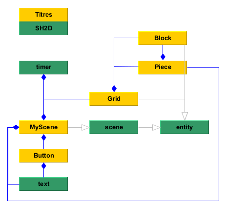

Titres

---

What is this?

This project is a tetris clone in a framework I created with the help of GLFW, GLEW and GLM. The version of tetris I am cloning is specifically NES Tetris.

  

Here is a picture that will show how it will look like:

  

In this game you have pieces that drop from

This is the class diagram of the game

